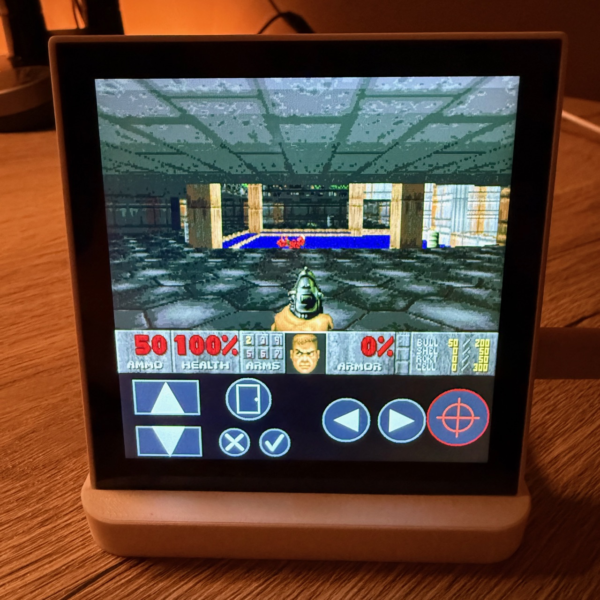
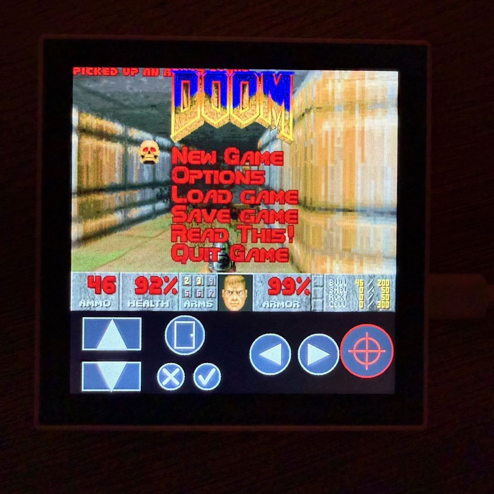

# ESP32P4Doom


A complete **independent bare-metal** DOOM port for the **ESP32-P4**, targeting the **Waveshare ESP32-P4-WIFI6-Touch-LCD-4B** (720×720 ST7703 touch display). Unlike other versions, this project is fully decoupled from official vendor BSP components, implementing its own lean hardware abstraction layer for maximum performance and control.

<p align="center">
  
  
</p>

## Key Improvements
- **Decoupled Architecture**: Removed dependency on `esp32_p4_function_ev_board`. All hardware drivers (I2C, I2S, SDMMC) are implemented natively in `bsp_p4_eval.c`.
- **SD Card WAD Loading**: Full support for loading `.wad` files from a MicroSD card. The system automatically searches both internal SPIFFS and the SD card.
- **PPA Hardware Scaling**: Internal `320x200` rendering upscaled to the `720x720` MIPI DSI display (4:3 letterbox) via the ESP32-P4's **Pixel Processing Accelerator**, freeing the CPU for game logic.
- **On-Screen Touch Controls**: GT911 touch buttons (move / turn / fire, plus use & menu) in the bottom band — fully playable without a keyboard.
- **Micro-Mixer Audio**: A dedicated 16-bit PCM Software Mixer broadcasting over I2S to the onboard ES8311 codec for high-fidelity SFX.
- **USB HID Support**: Optional plug-and-play support for standard USB keyboards.

## Features
- **Project Structure**: Cleaned and renamed entry point to `main.c`.
- **Hardware Abstraction**: Custom `bsp_p4_eval` handles:
  - **I2C**: Touch (GT911) and Audio Codec (ES8311) control.
  - **I2S**: Standard Philips mode for audio data.
  - **SDMMC**: High-speed 4-line SD card interface.
- **Bilingual Cleanliness**: Codebase refactored with all comments and logs standardized to English.

## Game and Mod Loading (WADs)
The engine features an automatic detection system for game files:
- **With SD Card**: The system prioritizes reading from the root of a FAT32 MicroSD card. It looks for base games in this order: `doom2.wad` -> `doom.wad` -> `doom1.wad`.
  - **Chiquito Mod**: If the file `chiquito.wad` is placed on the SD card alongside a base game, the engine will automatically load it as a PWAD (`-file`). This replaces the standard audio with the legendary sounds of Spanish comedian "Chiquito de la Calzada".
- **Without SD Card**: If no SD card is detected, the engine falls back to the internal SPIFFS memory, loading the default DOOM 1 Shareware (`doom1.wad`).

## Missing Features / To-Do
The following features are currently missing from this port:
- **Network** (Multiplayer)
- **Music**

## Requirements
* Waveshare ESP32-P4-WIFI6-Touch-LCD-4B (720×720 ST7703 panel, GT911 touch).
* USB keyboard optional — on-screen touch controls are built in.

**Where to buy:** [Waveshare (official)](https://www.waveshare.com/esp32-p4-wifi6-touch-lcd-4b.htm) · [AliExpress](https://s.click.aliexpress.com/e/_c3288v03) · [Amazon](https://amzn.to/3RvqoFg)

> The AliExpress and Amazon links are affiliate links that support the project at no extra cost to you. As an Amazon Associate I earn from qualifying purchases.

## Build and Flashing
1. **WAD Location**: Place your `.wad` files on the SD card or flash them to the `spiffs` partition.
2. **Compile and Flash**:
```bash
idf.py build flash monitor
```

## About the Developer
Developed and optimized for the ESP32-P4 by **Alejandro Villegas Alonso**.
If you are interested in embedded systems, ESP-IDF development, or want to discuss professional opportunities, feel free to connect!

* 👔 [Alejandro Villegas Alonso on LinkedIn](https://www.linkedin.com/in/alejandro-villegas-alonso-825041b1)

## Credits and Acknowledgements
* **Original ESP32-P4 port**: by Alejandro Villegas Alonso (see above).
* **Waveshare 4B port & touch controls**: adapted by [ESPBoards](https://espboards.dev).
* **[doomgeneric](https://github.com/ozkl/doomgeneric)**: The portable engine core by *ozkl*.
* **[id Software](https://github.com/id-Software/DOOM)**: The original legends of gaming.
* **[Espressif Systems](https://github.com/espressif)**: For the powerful P4 chip and IDF framework.

## License
Licensed under GPLv2.
